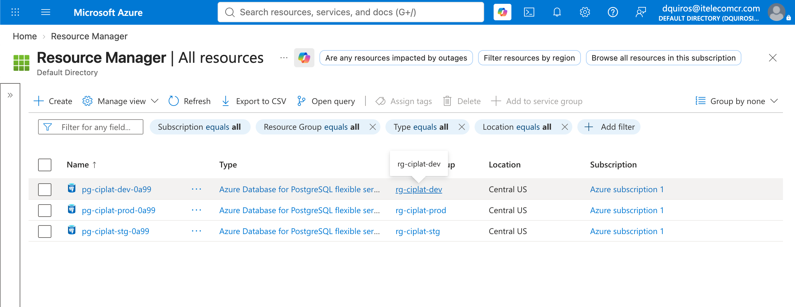
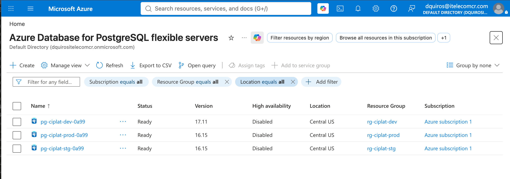
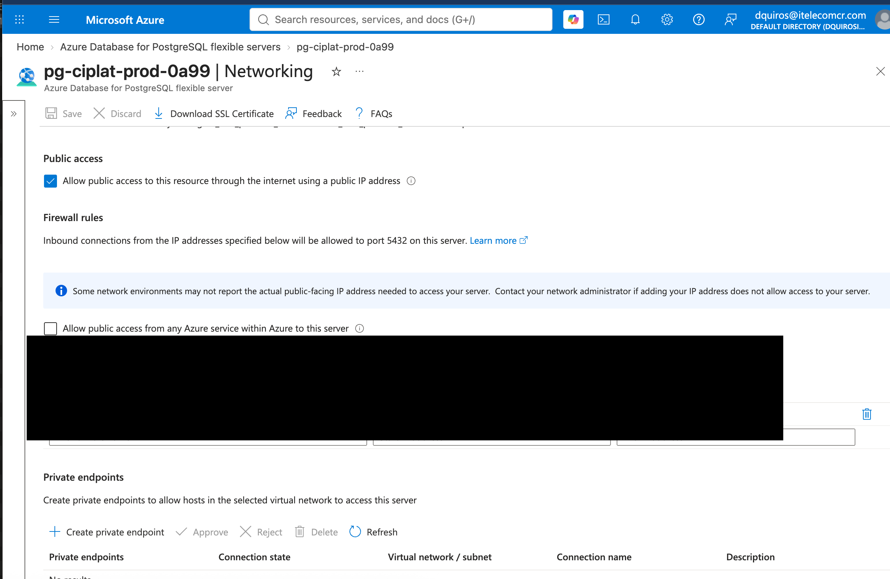
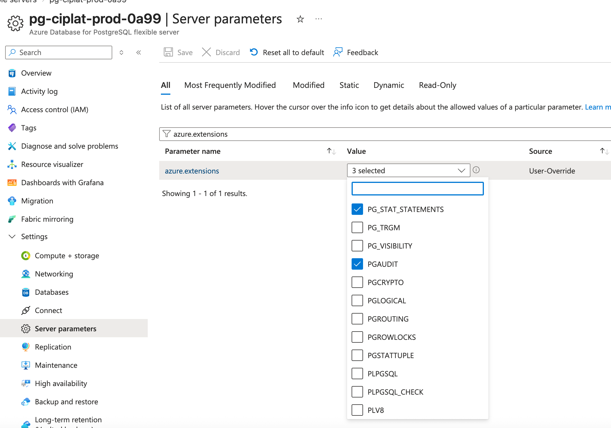
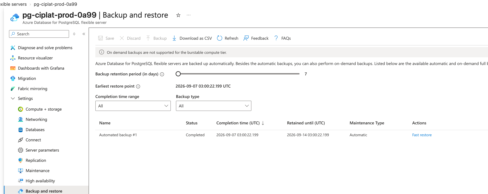
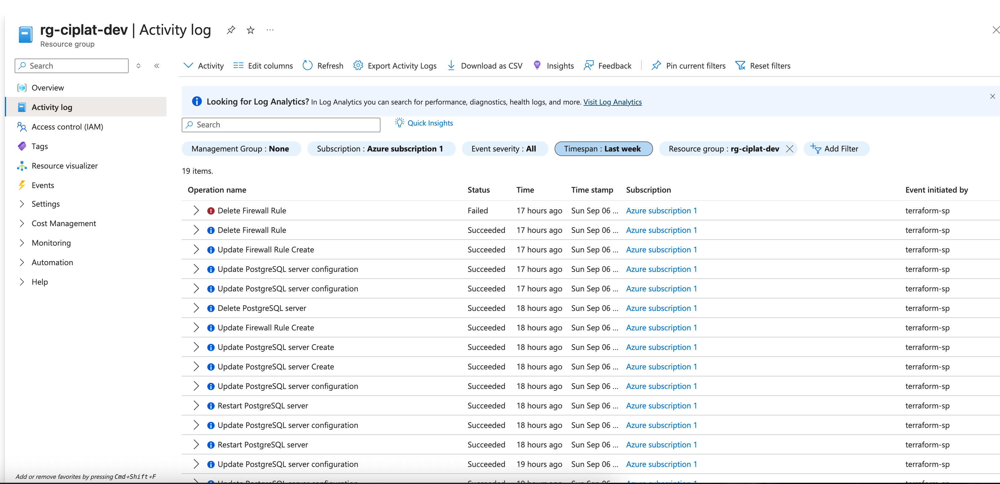

> **A note to Craig** — I know the ask was a 60–90 minute write-up, but I wanted to see this actually working with my own eyes before forming an opinion on it, so I built it. That's why this took longer than 90 minutes. Happy to talk through how you'd like me to scope my time going forward — but one thing I won't compromise on is skipping security details that could put our SOC 2 posture, and our customers' trust, at risk. Consider this me watching your back. — David

> **One more note, Craig** — you'll see Vault used for secrets throughout this. That's because I already run Vault in my own homelab, not because I think a project this size needs its own secrets manager introduced from scratch — please don't read it as over-engineering. In a real setup I'd expect this to work alongside Azure's own tools (Key Vault, managed identities), not replace them — just wanted to be upfront about where that choice came from. — David
# DevOps Platform Ownership Lab

A hands-on build exploring database ownership, environment isolation, and
production-readiness for a small AI platform team: Postgres (with pgvector)
across dev/staging/production, provisioned via Terraform, deployed through
Vercel + Next.js.

This is a personal sandbox exercise — not tied to any company's production
system, using only synthetic data. It was built to answer a specific
open-ended prompt about platform ownership by actually standing up the
setup and testing the claims directly, rather than reasoning about it only
on paper.

## Start here

- **[`DevOps-Platform-Ownership-Exercise-Response.md`](./DevOps-Platform-Ownership-Exercise-Response.md)**
  — the written answer to the exercise: database ownership, getting to
  production, and a read on the described setup. Every measurement in it
  is backed by the evidence log below.
- **[`VALIDATION-LOG.md`](./VALIDATION-LOG.md)** — the full command-by-command
  evidence trail: every phase of the build, real output, and the operational
  issues hit along the way (including the ones that weren't clean).

## Structure

- `main.tf`, `modules/pg-env/`, `envs/*.tfvars` — Terraform module for
  provisioning a Postgres Flexible Server environment; staging and
  production are the same module with different `.tfvars` values, and the
  diff between those files is the environment policy.
- `sql/roles.sql`, `sql/migrations/0001_init.sql` — the role/credential
  model (least-privilege roles, per-environment secrets) applied
  identically across environments.
- `web/` — a small Next.js app with a health-check endpoint used to test
  connectivity from a serverless deployment to the database.

## Screenshots

Visual confirmation alongside the evidence log, straight from the Azure Portal on this environment:

| | |
|---|---|
|  | **All resources** — three separate environments (`rg-ciplat-dev/stg/prod`) |
|  | **Flexible servers list** — all three `Ready`, correct versions and tiers |
|  | **Production networking** — the single-IP allow rule behind the Q3 finding (home IP redacted) |
|  | **Server parameters** — `vector`, `pgaudit`, `pg_stat_statements` enabled |
|  | **Backup and restore** — 7-day retention, a completed automated backup |
|  | **Activity log** — real operations from the restore drill (server create/delete, firewall changes), all initiated by `terraform-sp` |

## Secrets

No credentials are stored in this repository. Every credential is
generated and read from a secrets manager at runtime
(`vault-project-env.sh`). Terraform state files and plan files, which can
contain resource attribute values in plaintext, are excluded via
`.gitignore` and were never committed.
